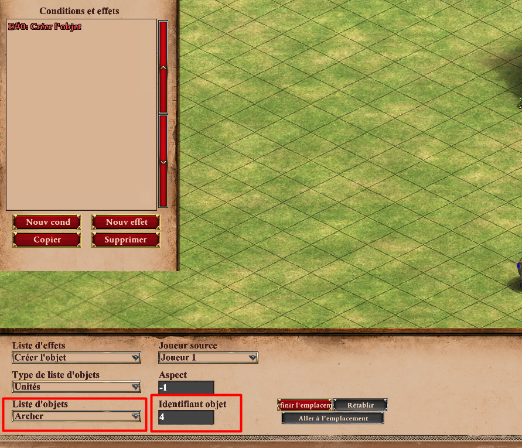
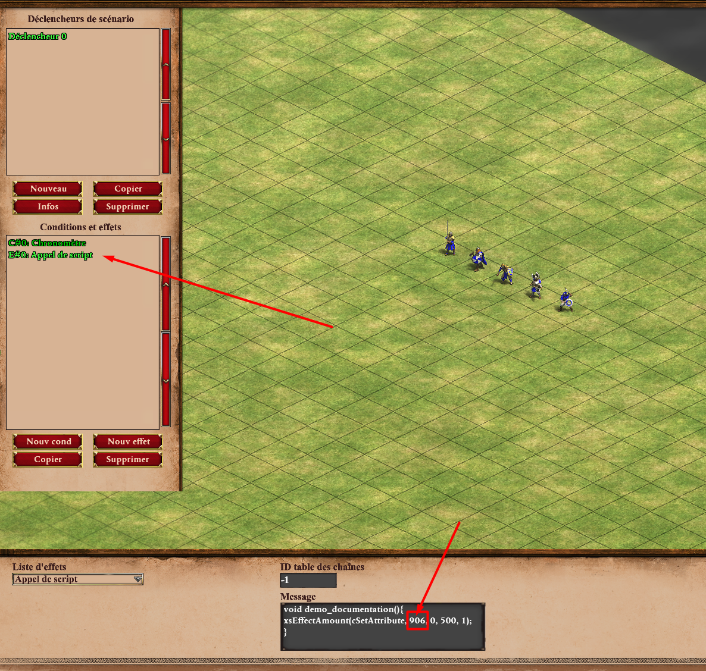
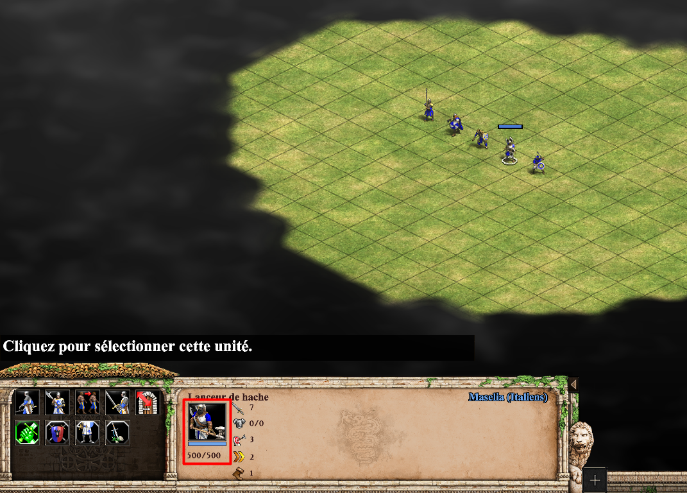
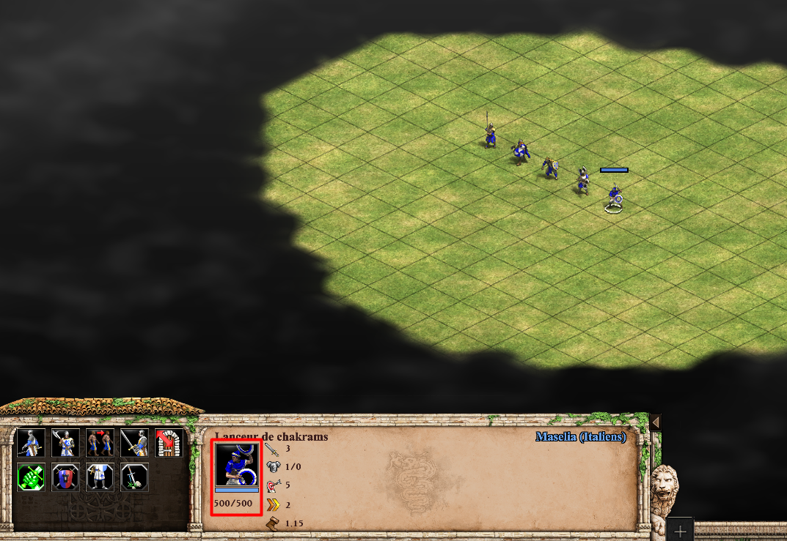
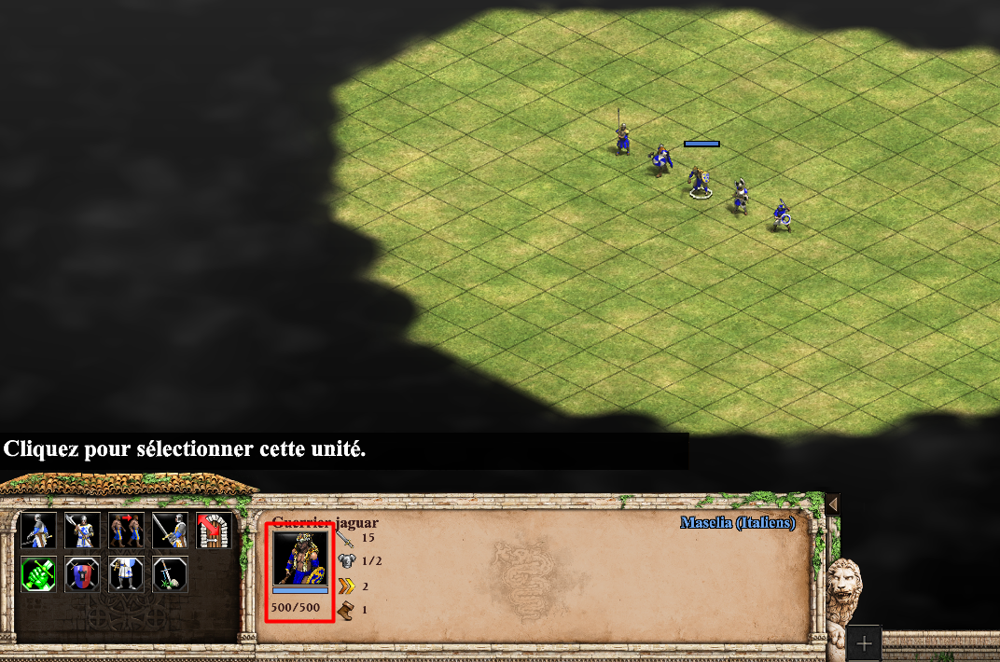
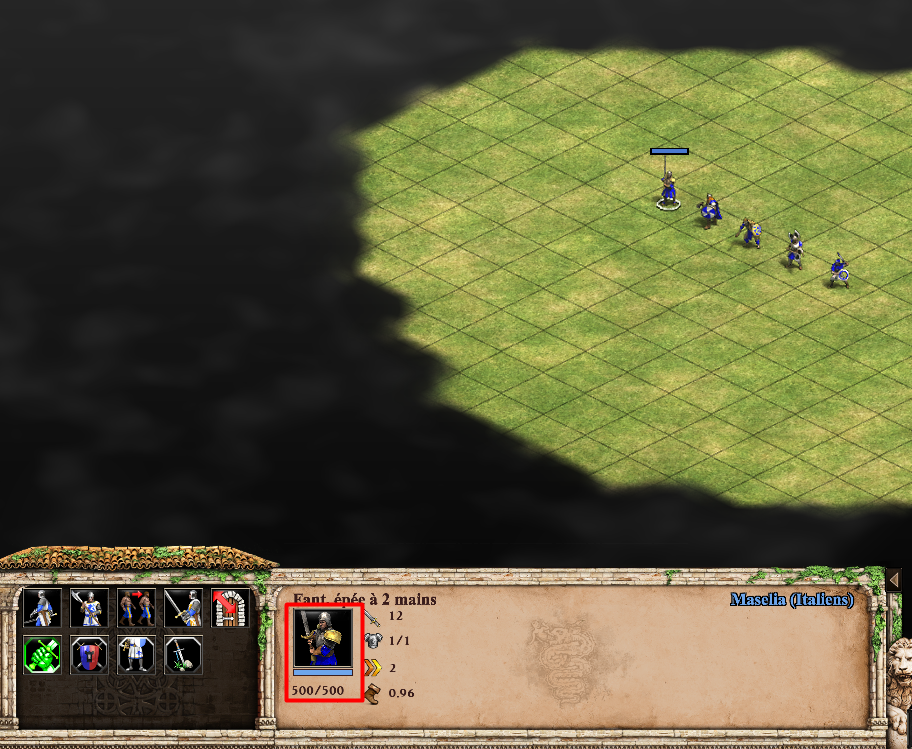
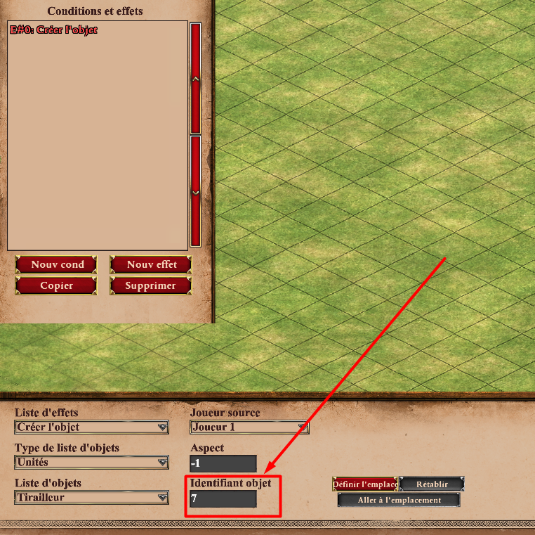
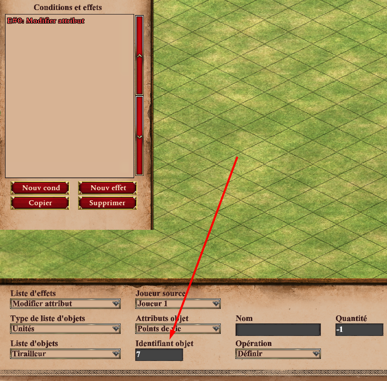
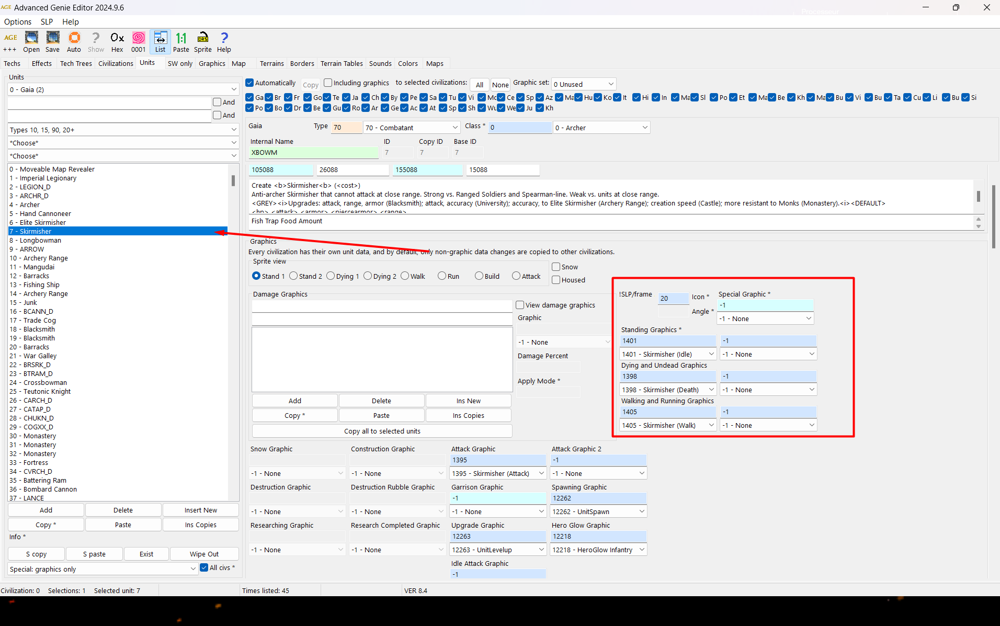

La notion des ID
================

📌 **Définition d’un ID :**

Le terme *ID* vient de l’anglais *identifier*, soit un identifiant unique.  
Selon **Wikipédia**, un identifiant est utilisé pour repérer de manière unique un élément dans un système :  
- en **programmation**, pour distinguer les objets ou lignes d’une base de données,  
- en **électronique**, pour désigner un courant dans un transistor (*anecdote technique*),  
- ou encore comme abréviation du mot latin *idem*, signifiant « le même ».

---

Pourquoi les ID sont-ils importants dans l’éditeur ?
-----------------------------------------------------

Parce que **l’éditeur de scénarios d’Age of Empires II utilise des identifiants pour tout.**  
Chaque élément du jeu possède un ou plusieurs ID :

- 🧍 **Unités**
- 🏰 **Bâtiments**
- 💰 **Ressources**
- 🧱 **Objets placés sur la carte**
- ⚔️ **Groupes d’unités**
- 🏛️ **Architectures visuelles**
- 🧠 **Effets personnalisés via XS ou scripts Python**

---

Visualiser les ID dans l’éditeur
--------------------------------

Vous pouvez voir certains ID directement dans l’éditeur, notamment dans les effets suivants :

- **Créer un objet**
- **Modifier un attribut**
- **Définir une unité ou un bâtiment précis**

---

Groupes d’unités
----------------

Certaines catégories du jeu possèdent des **ID de groupe**. Par exemple :

- Toutes les unités d’**infanterie** appartiennent au groupe `901`.
- Les unités de **cavalerie** ou d’**archerie** ont aussi leurs propres ID de groupe.

Cela permet de **filtrer ou affecter des effets à des familles entières d’unités**, sans devoir toutes les sélectionner individuellement.

---

ID d’apparence (Architecture)
-----------------------------

L’apparence d’un bâtiment change selon la **civilisation** ou le **type d’architecture** :

- Une caserne asiatique n’a pas le même ID qu’une caserne européenne ou mésoaméricaine.
- Ces ID permettent de créer des **effets de transformation visuelle**, ou de personnaliser les civilisations dans vos scénarios.

---

ID de référence des objets placés
---------------------------------

Chaque élément que vous **placez sur la carte** (ex: maison, marché, moulin…) se voit attribuer un **ID de référence unique**, appelé parfois *reference_id*.

Cela permet, notamment avec des outils avancés comme **AoE2ScenarioParser**, de :

- Suivre un objet précis
- Le modifier dynamiquement
- Créer des effets ciblés sans ambiguïté

🎯 *Important* : si vous n’utilisez pas d’outils de script, cette notion est **moins essentielle**, mais utile à connaître pour gagner en précision.

---

Quand les ID deviennent essentiels
----------------------------------

Les ID sont **indispensables** si vous voulez :

- Créer des mécaniques complexes (ex: changement de skin, évolution d’un objet, effets dynamiques)
- Faire du **tracking** d’unité (suivre un héros sur la carte)
- Utiliser des **scripts XS**
- Automatiser via des outils comme **AoE2ScenarioParser** (Python)

---

Vous voilà désormais informé du fonctionnement des ID dans Age of Empires II: Definitive Edition.
Cette notion constitue une étape essentielle pour passer du statut de créateur débutant à celui de créateur avancé.

Les ID sont indispensables non seulement pour modifier les attributs des éléments du jeu, mais aussi pour récupérer certaines informations clés dans votre scénario.

Comment trouver les ID dans Age of Empires II
---------------------------------------------

Il existe plusieurs méthodes pour trouver les **ID** des unités, bâtiments, classes et apparences dans *Age of Empires II: Definitive Edition*.

Dans ce paragraphe, vous allez découvrir où et comment identifier ces différents types d’ID, des plus accessibles aux plus techniques.

### 📌 Première méthode : via l’éditeur de scénario

Dans l’éditeur, plusieurs **effets** dans les déclencheurs permettent d’afficher les ID des unités sélectionnées. Voici deux exemples courants :

- **Créer l’objet** :
  

- **Modifier l’attribut** :
  

Dans les deux cas, l’ID s’affiche automatiquement dans le champ prévu lorsque vous sélectionnez une unité ou un bâtiment.

**✅ Avantages :**
- Méthode rapide pour obtenir un ID précis sur le moment ;
- Intégrée directement dans l’éditeur, sans outil externe.

**❌ Inconvénients :**
- Certains ID sont cachés ou inaccessibles (ex. : ID de classe, d’apparence) ;
- Peu pratique pour consulter plusieurs ID à la suite.

---

### 🌐 Deuxième méthode : le site officiel des scripts IA

Un site très utile pour les créateurs de scénarios ou d’IA est celui des **scripteurs IA officiels**. Il contient plusieurs **tableaux d’objets** avec leurs ID associés.

- Lien du site : *(https://airef.github.io/index.html)*
- Tableau des objets (unités, bâtiments, groupes) : *(https://airef.github.io/tables/objects.html)*

**🟢 Avantages :**
- Clair, organisé, et plus rapide pour des recherches en masse ;
- Contient des groupes d’unités et de bâtiments utiles pour les conditions dans les déclencheurs.

**🔴 Limites :**
- Ne contient **pas** les ID d’apparence ni certains ID techniques (internes au moteur de jeu).

---

### 🛠️ Troisième méthode : avec le logiciel Advanced Genie Editor (AGE)

Pour obtenir des ID **d’apparence**, il faut utiliser un outil externe : le **Advanced Genie Editor** (AGE), inclus dans les fichiers du jeu ou téléchargeable via la communauté.

📍 Ce logiciel permet d’explorer les fichiers `data` du jeu, et d’identifier précisément les variations d’apparence liées aux architectures (asiatique, européenne, mésoaméricaine, etc.).

👉 Pour apprendre à utiliser AGE :

- Suivez le guide : **"Advanced Genie Editor – Utilisation de base"**  
  *(Lien ou section à venir)*
---
